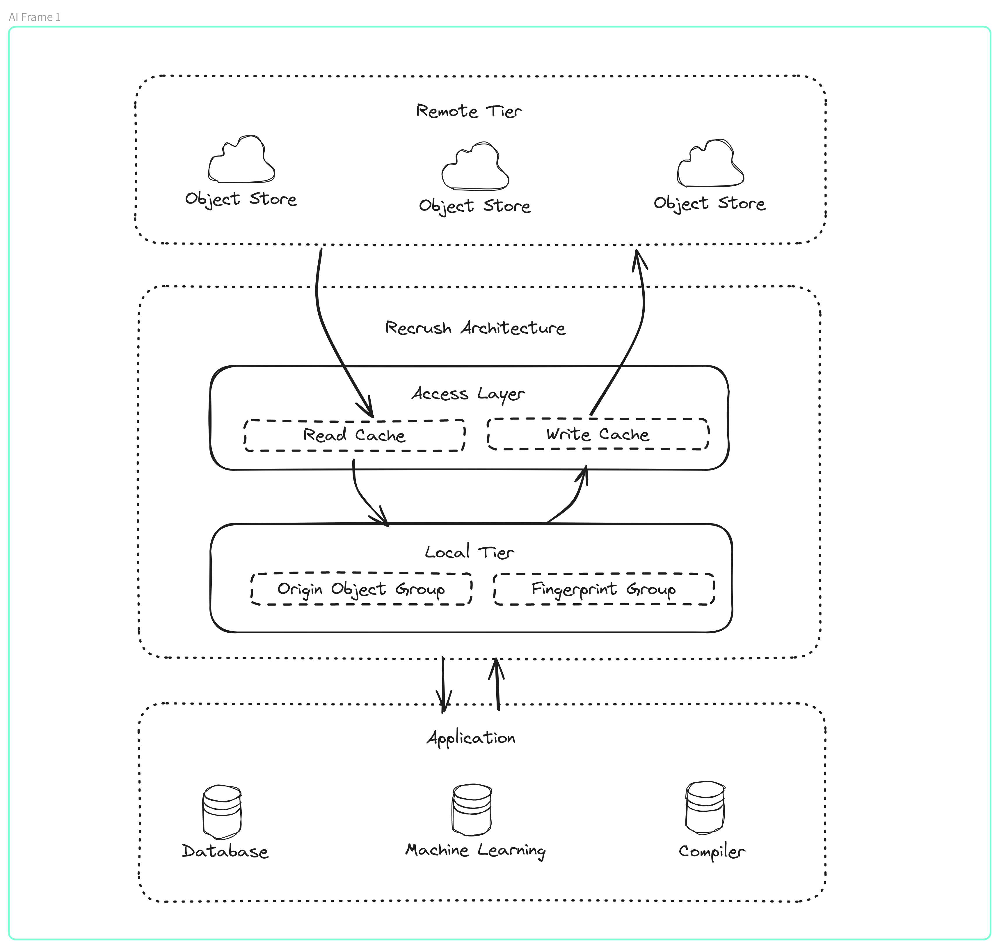

# recrush

(WIP) The Next-Generation Intelligent Caching Solution. Insight into your data flow, beyond mere collaboration.

## Architecture



## Workspace Management

recrush uses [cargo-hakari](https://crates.io/crates/cargo-hakari) to ensure that all workspace dependencies enable the same set of features. This dramatically improves compilation time when switching between different subsets of packages, because the sets of enabled features remain consistent.

```bash
cargo install cargo-hakari --locked # only needed on the first run
cargo hakari generate
cargo hakari manage-deps
```

## Why "recrush"?

**[Urban Dictionary: recrush]**

> noun or verb (ree-krush)
>
> The action or process of having a crush on someone again after getting over them the first time.
> It can happen days or years after the initial crush.
> It is not considered a recrush if the person has had a continual crush for the duration of time, there must be evidence of uncrushing. 

[Urban Dictionary: recrush]: https://www.urbandictionary.com/define.php?term=recrush

## License

Licensed under either of

- Apache License, Version 2.0, ([LICENSE-APACHE](LICENSE-APACHE) or <http://www.apache.org/licenses/LICENSE-2.0>)
- MIT license ([LICENSE-MIT](LICENSE-MIT) or <http://opensource.org/licenses/MIT>)

at your option.

### Contribution

Unless you explicitly state otherwise, any contribution intentionally submitted for inclusion in the work by you, as defined in the Apache-2.0 license, shall be dual licensed as above, without any additional terms or conditions.
